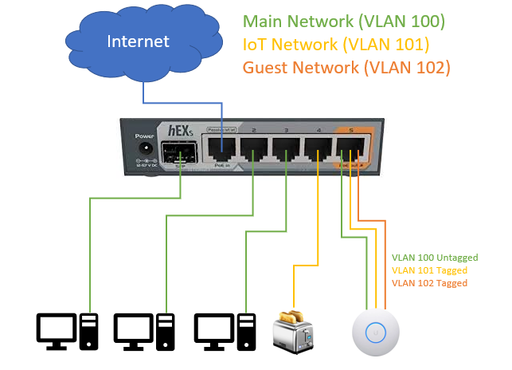

## Secure Mikrotik Router Hex S RB760iGS for Home Office Use
_**Disclaimer:** These are personal notes for config and there are no guarantees of security after applying these config settings._

This is a guide for setting up the Mikrotik Hex S RB760iGS Router and was produced from the links below and with help from the [Mikrotik Forum](https://forum.mikrotik.com/viewtopic.php?f=13&t=159905).

I bought my router through Amazon (Affiliate Link):

[Amazon.com: MikroTik hEX S Gigabit Ethernet Router with SFP Port (RB760iGS)](https://amzn.to/302DoEf)

## Home Office Network Design



This network design assumes the following
- Port 1 Wide Area Network (WAN) connected to ISP/Modem
- Port 5 Access Point (AP) for WiFi
- Three separate networks seperated with VLANs
  - Main Network 192.168.100.0/24 - VLAN 100 (for user devices like laptop and phones)
    - Ports 2-3
    - Port 5 (with connected wifi access point)
  - Device/IoT Network 192.168.101.0/24 - VLAN 101 (for internet enabled devices that are not as secure like wifi power switches, sensors etc)
    - Port 4
    - Port 5 (with connected wifi access point)
  - Guest Network 192.168.102.0/24
    - Port 5 (with connected wifi access point)

Note: my AP (Ubiquiti) requires the main VLAN (VLAN 100) to be untagged on Port 5. However, other APs (e.g. tplink) have been known to require the main VLAN to be tagged as well.

## Command basics
Slash takes you back to the root/home:
```
/
```
Specify a feature of the router with '/<feature> <sub-feature>'. If you then press enter you will be taken to that feature.
```
/system interface
```
View what is set with 'print' or 'export' which gives the command to set the current configuration:
```
/system interface
print
#or
/system interface export
```
Line starting with a '#' is a comment eg:
```
#This command lists the assigned dhcp ip addresses
/ip dhcp-server lease print
```
View the full current configuration of the router with (this is also the command you can run to get your config to pust to forums to get help):
```
/ export hide-sensitive
```
For more on commands see the [Basic Commands in Mikrotik Documentation](https://wiki.mikrotik.com/wiki/How_to_configure_a_home_router#Basic_commands).

## Start with a reset
It is assumed that you have reset the router to the default configuration.
- To reset physically
  - Disconnect power
  - Press and continue to hold the reset button
  - Connect power
  - When the sfp port light comes on and then begins to flash, release the reset button.
- To reset remotely
  - Connect to the router and run the command below.
  - Enter 'y' and enter for yes when prompted.
```
/system reset-configuration
```
The router should beep twice once it has finished rebooting.

## Login to the router
 - Connect computer to one of the ports 2-4 and
   - SSH to the router on 192.168.88.1 with username 'admin' and password (blank). Note: newer versions have default password written on the back.
   - Winbox to the router using discovered MAC Address
 - use username 'admin' and password (blank).

## Create VLANs
We have to add our VLANs to the bridge and then assign them interfaces. We also need to add tehm to lists to be able to manage them in the firewall.

```
#Setup VLANs
/interface vlan
add interface=bridge name=main-vlan vlan-id=100
add interface=bridge name=iot-vlan vlan-id=101
add interface=bridge name=guest-vlan vlan-id=102

/interface list
add name=VLAN
add name=MGMT

/interface list member
# add to the exiting list so we maintain access to router
add interface=main-vlan list=LAN
add interface=iot-vlan list=LAN
add interface=guest-vlan list=LAN
# this is our new list
add interface=main-vlan list=VLAN
add interface=iot-vlan list=VLAN
add interface=guest-vlan list=VLAN
# Management list
add interface=main-vlan list=MGMT
```

## Setup IP Addressing
We need to assign each VLAN it's own subnet and dhcp servers to give out addresses when hosts connect to the VLANs.

```
# IP Setup
/ip pool
add name=main-pool ranges=192.168.100.10-192.168.100.254
add name=iot-pool ranges=192.168.101.10-192.168.101.254
add name=guest-pool ranges=192.168.102.10-192.168.102.254

/ip address
add address=192.168.100.1/24 interface=main-vlan
add address=192.168.101.1/24 interface=iot-vlan
add address=192.168.102.1/24 interface=guest-vlan


/ip dhcp-server network
#set comment=main-dhcp-network [find comment=defconf]
add address=192.168.100.0/24 gateway=192.168.100.1 comment="main-dhcp-network"
add address=192.168.101.0/24 gateway=192.168.101.1 comment="iot-dhcp-network" 
add address=192.168.102.0/24 gateway=192.168.102.1 comment="guest-dhcp-network"

/ip dhcp-server
add address-pool=main-pool interface=main-vlan disabled=no name=main-dhcp
add address-pool=iot-pool interface=iot-vlan disabled=no name=iot-dhcp
add address-pool=guest-pool interface=guest-vlan disabled=no name=guest-dhcp
```

## Domain Name Server
We are going to tell the router to use the CloudFlare DNS and Google Servers as they are fast. If you want to use your ISPs DNS details then skip this step.

```
# set the dns main static and google and cloudflare
/ip dns static
set address=192.168.100.1 [find name=router.lan]
/ip dns 
set servers=1.1.1.1,8.8.8.8,1.0.0.1,8.8.4.4
# disable ISP DNS servers obtained through DHCP.
/ip dhcp-client
set  use-peer-dns=no [find interface=ether1]
```

## VLAN Port Configuration
We need to tell the router which VLANs should relate to which ports. Note that Port 5 is a Hybrid port as it is configured with multiple VLANs.

```
# Ingress Behavior
/interface bridge port
set pvid=100 frame-types=admit-only-untagged-and-priority-tagged [find bridge=bridge]
set pvid=101 [find interface=ether4]
set frame-types=admit-all [find interface=ether5]

# Egress Behaviour
/interface bridge vlan
add bridge=bridge tagged=bridge untagged=ether2,ether3,ether5,sfp1 vlan-ids=100 comment="main-vlan"
add bridge=bridge untagged=ether4 tagged=bridge,ether5 vlan-ids=101 comment="iot-vlan"
add bridge=bridge tagged=bridge,ether5 vlan-ids=102 comment="guest-vlan"
```

## Enforcing/Enabling the VLAN Configuration
The router will not enforce our VLAN configuration until we enable VLAN Filtering. After enabling vlan filtering we will get disconnected and you will need to reconnect using the routers VLAN100 subnet addresss '192.168.100.1'.

```
# enable vlan filtering
/interface bridge
set vlan-filtering=yes [find name="bridge"]

```

## Remove default IP Configuration
Now that we have setup new subnets that relate to the VLANs we can remove the default subnet 192.168.88.0/24.

```
# remove default ip addressing
/ip dhcp-server
remove [find name=defconf]
/ip dhcp-server network
remove [find gateway=192.168.88.1]
/ip pool
remove [find name=default-dhcp]
/ip address
remove [find interface=bridge]
```

## Configure the Firewall
We now need to setup the firewall to prevent communication between our VLANs and to allow the IoT and Guest VLANs to only be able to access the DHCP and DNS Server on the router (eg. can't connect to manage the router).

```
# Clear and re-set the firewall for ease of ordering
/ip firewall filter
remove [find action!="passthrough"]

/ip firewall filter
# Input Chain
add action=accept chain=input comment="defconf: accept established,related,untracked" connection-state=established,related,untracked
add action=drop chain=input comment="defconf: drop invalid" connection-state=invalid
add chain=input action=accept in-interface-list=MGMT comment="Allow main-vlan/MGMT access to all router services"
add chain=input action=accept in-interface-list=VLAN dst-port=67 protocol=udp comment="Allow VLAN DHCP"
add chain=input action=accept in-interface-list=VLAN dst-port=53 protocol=udp comment="Allow VLAN DNS UDP"
add chain=input action=accept in-interface-list=VLAN dst-port=53 protocol=tcp comment="Allow VLAN DNS TCP"
add chain=input action=accept in-interface-list=VLAN protocol=icmp comment="Allow VLAN ICMP Ping"
add chain=input action=drop comment="Drop all other traffic"
# Forward Chain
add chain=forward action=accept comment="defconf: accept in ipsec policy" ipsec-policy=in,ipsec
add chain=forward action=accept comment="defconf: accept out ipsec policy" ipsec-policy=out,ipsec
add action=fasttrack-connection chain=forward comment="defconf: fasttrack" connection-state=established,related
add action=accept chain=forward comment="defconf: accept established,related, untracked" connection-state=established,related,untracked
add action=accept chain=forward connection-state=new in-interface-list=VLAN out-interface-list=WAN comment="VLAN Internet Access Only"
add action=accept chain=forward connection-nat-state=dstnat connection-state=new in-interface-list=WAN disabled=yes comment="Allow Port Forwarding - DSTNAT - enable if need server" 
add action=drop chain=forward comment="defconf: drop invalid" connection-state=invalid
add action=drop chain=forward comment="Drop all other traffic"

```

## Secure the router
We lock down the router management features to reduce the ways someone might try to access the router.

```
# Disable all the configuration methods except ssh, www-ssl and winbox
/ip service enable ssh,www-ssl,winbox
/ip service disable telnet,ftp,www,api,api-ssl

# Ensure only winbox MAC Address based access from MGMT aka main-vlan
/ip neighbor discovery-settings set discover-interface-list=MGMT
/tool mac-server mac-winbox set allowed-interface-list=MGMT
/tool mac-server set allowed-interface-list=MGMT

# Disable unused wireless related packages
/system package
disable hotspot
disable wireless

```

## Setup Self Signed SSL Certificate for www-ssl web interface
Note that with the self signed certificate you will get browser warnings that it is insecure. This is probably ok for a home setup and ensures that the traffic to the router is encrypted which is important if you are accessing the router over wifi.

```
# create a self signed cert for www-ssl
/certificate
add name=local-cert common-name=local-cert key-usage=key-cert-sign,crl-sign
sign local-cert

add name=webfig common-name=192.168.100.1
sign webfig

/ip service
set www-ssl certificate=webfig
```

## Setup bandwith monitoring graphs
It is handy to see how much data has been uploaded/downloaded on the WAN and each VLAN. You can view the graphs by accessing the router IP slash graphs (https://192.168.100.1/graphs). We have also enabled CPU, Memory and Storage graphing.

```
# Allow viewing resource and usage graphs on main-vlan for each main interface
/tool graphing resource
add allow-address=192.168.100.0/24
/tool graphing interface
add allow-address=192.168.100.0/24 interface=ether1
add allow-address=192.168.100.0/24 interface=main-vlan
add allow-address=192.168.100.0/24 interface=iot-vlan
add allow-address=192.168.100.0/24 interface=guest-vlan
```

## Setup a new admin account
It is important to set a new username and password to prevent hackers from attempting to access the router with default settings.

```
# Setup a new administrative account
/user add name=YOUR_UNIQUE_NAME password=YOUR_STRONG_PASSWORD group=full
/user remove admin
```

## Configure automatic updates
Its important to run the latest version of routerOS so that your router has the latest security fixes. The following adds a script that every second day and attempts to update the router. If there is no update then the script exits with an error on the 'download 0' command and will not reboot the router.

```
# create download and update script
/system script add name=DownloadAndUpdate source="\
/system package update\r\n\
check-for-updates once\r\n\
:delay 30s;\r\n\
install\r\n\
/"
  
# firmware update script
/system script add name=UpdateFirmware source="\
/system routerboard upgrade\r\n\
:delay 3s;\r\n\
/system reboot\r\n\
/"

# schedule scripts to run every 2 days
/system scheduler
add interval=2d name=Upgrade_Software on-event="run DownloadAndUpdate" policy=ftp,reboot,read,write,policy,test,password,sniff,sensitive start-date=apr/25/2020 start-time=03:00:01
add interval=2d name=Upgrade_Firmware on-event="run UpdateFirmware" policy=ftp,reboot,read,write,policy,test,password,sniff,sensitive start-date=apr/25/2020 start-time=04:00:01
```

## Reboot the router
Everything should now be setup so lets reboot to check that the router comes back up with the correct config.
```
/system reboot
```

## Test the configuration
Its a good idea to connect to each VLAN and check that you can only access that VLAN.

## Backup configuration
Run the command and then in winbox or webfig go the 'Files' menu and select to download the file with the name you specified in the command.
```
/system backup save name=MyConfig
```


## General Links

- [Mikrotik: How to configure a home router](https://wiki.mikrotik.com/wiki/How_to_configure_a_home_router)
- [Mikrotik: Securing Your Router](https://wiki.mikrotik.com/wiki/Manual:Securing_Your_Router)
- [Mikrotik Help: Webfig - Enable HTTPS](https://help.mikrotik.com/docs/display/ROS/Webfig)
- [Murray's Blog: Use a Mikrotik as Your Home Router](https://blog.ligos.net/2017-02-16/Use-A-Mikrotik-As-Your-Home-Router.html)
- [Mikrotik Forums: pcunite - Using RouterOS to VLAN](https://forum.mikrotik.com/viewtopic.php?t=143620)
- [Mikrotik Forums: Help checking my hEX S config for home office](https://forum.mikrotik.com/viewtopic.php?f=13&t=159905)
- [Rick Frey Consulting: Auto upgrade Mikrotik](https://rickfreyconsulting.com/auto-upgrade-with-mikrotik/)
- [Mikrotik: Backup](https://wiki.mikrotik.com/wiki/Manual:System/Backup#Saving_a_backup)
- [Mikrotik: Auto Upgrade](https://wiki.mikrotik.com/wiki/Manual:Upgrading_RouterOS#RouterOS_massive_auto-upgrade)

## Advanced Links

 - [Mikrotik DoS Attack Protection](https://wiki.mikrotik.com/wiki/DoS_attack_protection)
 - [Mikrotik DDos Detection and Blocking](https://wiki.mikrotik.com/wiki/DDoS_Detection_and_Blocking)
