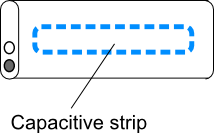
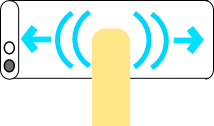
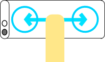

# How Apple should have implemented the controls on the new iPod Shuffle

Most people will have heard of the new [iPod Shuffle](http://www.engadget.com/2009/03/12/new-ipod-shuffle-first-hands-on/) by now and as you know it has the controls on the earphones and not the main unit. This means you can’t use it with good quality headphones or plug it into your stereo for playing music with friends etc. Which is just a pain, but then again anyone who sees this as a problem, probably isn’t in the target market for the shuffle!

Also isn’t this Sony’s design? They had an on wire control for their CD and MiniDisc players way way back.

Anyway I wanted to share how I thought Apple should have implemented the controls on the new shuffle.

## The Mechanism

Rather than having the controls on the headphone wire, the shuffle body should have a capacitive strip down the front. The strip would sense your finger just like the click wheel on existing iPods.

## Control

You can then use a series of simple and intuitive gestures to control your music.

| Gesture | Control |
| ------- | ------- |
|  | 	**Play/Pause** Touch once to pause or play the current song. |
|  | 	**Next Song** Slide your finger from left to right across the shuffle to go to the next song. |
|  | 	**Previous Song** Slide your finger from right to left across the shuffle to go to the previous song. |
|  | 	**Voice Over** Double touch the shuffle to have it voice over the current artist and song name. |
|  | 	**Choose Playlist** Slide your finger back and forth to activate the voice over playlist selection. Single touch to select a playlist after playlist selection has been activated. |
|  | 	**Volume** To increase the volume slide left to right and hold, let go when the volume is at the desired level. To decrease the volume slide right to left and hold, let go when the volume is at the desired level. |

## Conclusion

I think that this setup would be much easier to use, headphone/stereo friendly and a lot simpler/cleaner looking.

It is also possible that the unit is too small and would start trying to play when you were clipping it on to things, but hey thats what the on/off switch is for right…

