# Using Food Dye Colouring as Ink

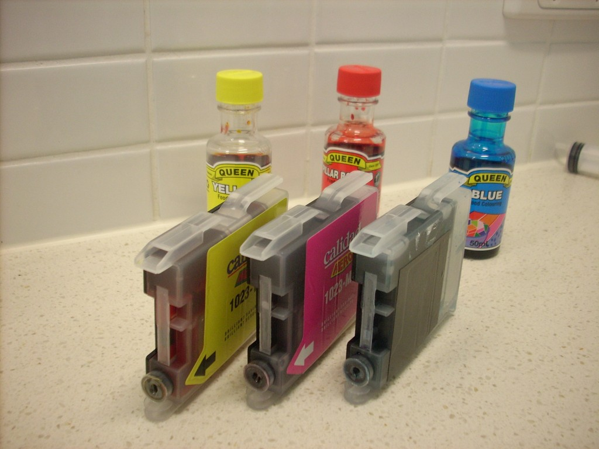

A new set of generic ink cartridges for my ink-jet printer costs around $25 which is too much considering I only get about 10 (colour) pages from them as the printer uses up ink over time keeping the heads clean. So when I was at the supermarket and noticed that 50ml of food colouring is only $1 I had to try using it for printing. Also assuming it would work I bought some rice paper for edible printing!

**WARNING:** This may well destroy your print heads and thus your printer. Food Colouring may become toxic during the printing process. Try only at your own risk.

## Ingredients

- Gloves (unless you are happy to have coloured hands)
- Sink/Basin (ink is going to spill, its part of cartridge refilling)
- Blue Food Colouring (for Cyan)
- Pink Food Colouring (for Magenta – I used Red and it made everything a bit dark when printing)
- Yellow Food Colouring (for Yellow!)
- Black Food Colouring (for Black – I wish I had bought some – my printing was not edible because had not replaced my black)
- Syringe (try to get a non-sharp one, if you order one off deal-extreme like i did be very careful since there is no guarantee it is sterile)
- Instructions for refilling your printer cartridges (search the web – mine were simple enough not to need any)
- Rice Paper (It needs to be as thin and bendy as possible)

## Step One: Flush Out Cartridges

The first thing I did was inject my cartridges with water and then empty it out using the syringe. I did this a few times until as much as possible of the previous ink was removed.

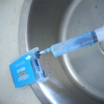

## Step Two: Determine Capacity

I did one final flush with water to determine the capacity of the cartridges before I was working with the food dye. Its much better to have the cartridges nearly full than overflowing everywhere. My cartridges have an interesting micro/mini fluid network in them which meant it was only easy to half fill mine.

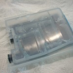

## Step Three: Fill Cartridges

Fill the syringe with the measured capacity of ink and inject it into the corresponding color of ink cartridge. Then re-install them into your printer.

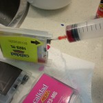 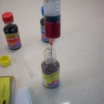

## Step Four: Cleaning

If you haven’t printed in colour for a while like me you’ll meed to run your printers cleaning cycle a few times to bring your print head back to life. I had to run mine about 10 times however if you print colour regularly this should not be a problem. You can check the print heads are clean properly by printing a test page. If you click my test pages image to the right you can see how the print head slowly comes back after many runs of the cleaning function.

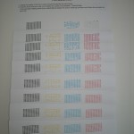 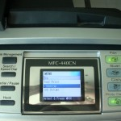

## Step Five: Test Print Image

Now that everything should be working it is time to print a test image. I chose a full A4 color wheel to test with to get an idea of how well the colours are produced by food colouring. I think you’ll agree from the images below it works fairly well. On my print the pink/purples don’t come out very well. I think that is because I used red dye for magenta rather than pink, unfortunately my supermarket was out of pink food dye.

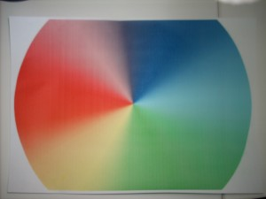 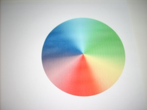 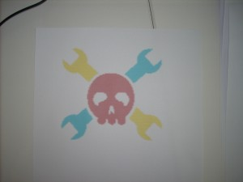

## Step Six: Rice Paper

I cut some of the rice paper to roughly A5 and put it in the printer. It worked the first time printing a chocolate flake pattern. However on subsequent tries the rice paper was too britle and broke up in the printer. To overcome this problem I taped the rice paper to an A4 sheet and then printed on it. This worked much better, however It still cracked a little when cutting it. I am sure a better rice paper can be found just not at my local supermarket.

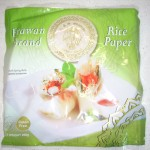 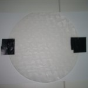 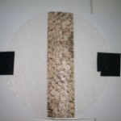 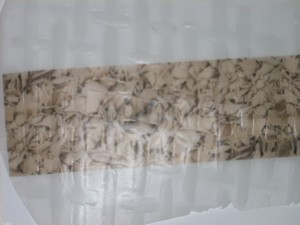

## Cake!

Unfortunately was unable to sample it as I had not replaced my black ink with food dye.
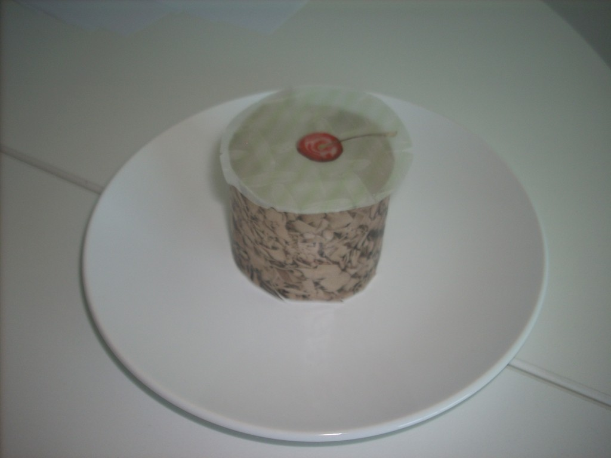

## Conclusions

- Food Colouring works just as well for general printing like reports with graphs and word art etc.
- Photo’s will probably come out looking a little off.
- Only time will tell if the food colouring is damaging the print heads.

  This could be a great way to do custom decoration on cakes or other foods (Christmas/Birthdays/Halloween). I’ll try and put an update on this post a month or two down the track to let you know if the print heads got damaged or are still working.
