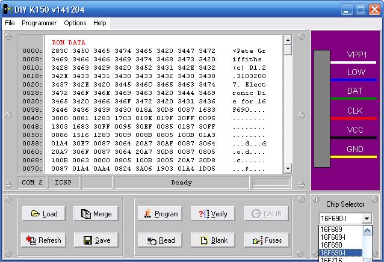
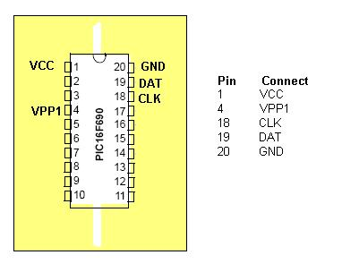
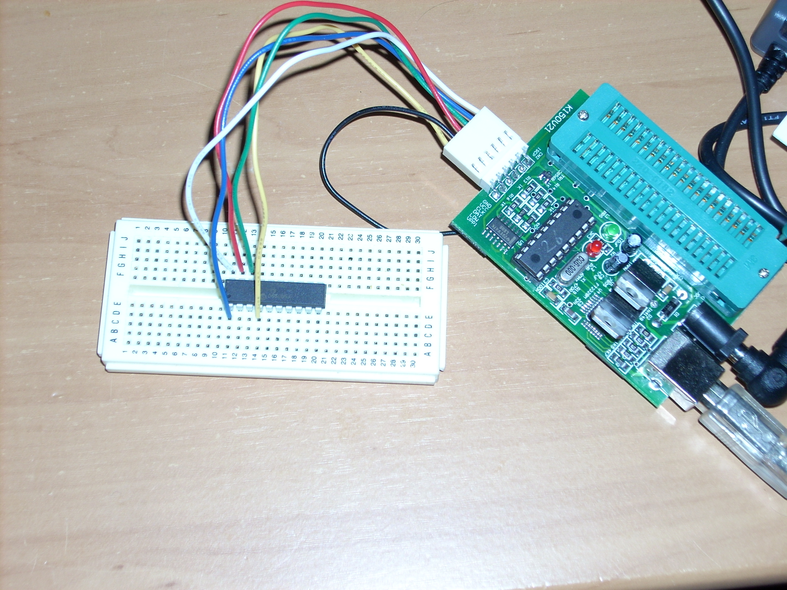

# Program a PIC 16F690 with the DIY Kit 150 Programmer

My friend and I bought some PIC16F690 microprocessors. However we didn’t realise that our DIY Kit 150 programmers did not support the 16F690. Luckily a new firmware and software update is available (Beta) which supports the 16F690. Read on to see the process I used to upgrade my programmer and program my 16F690.

You will need the following:

- DIY Kit 150 programmer
- DIY Kit 150 ICSP Cable/Break Out
- Bread board (the electronics kind)
- 1x PIC 16F628A
- The version of Micropro that works with your KIT150 programmer
- Beta Version 26 MicroPro and firmware pack
    - This is lurking around on the web, I downloaded it here. Distrubution of the beta was stopped because some company in the US was ripping off kitsrus.
- Test program/hex file for the 690
    - I used [die690inet.zip](http://petesworld.demon.co.uk/code/die690inet.zip) from [Pete Griffiths website](http://www.petesworld.demon.co.uk/), be sure to check out [his site](http://www.petesworld.demon.co.uk/homebrew/PIC/picprojects.htm) he has posted a load of PIC projects and info there.

    The DIY Kit 150 programmer has a firmware chip (a pic16f628a) which can only be used with the corresponding verison of Micro Pro. In order to upgrade to the new version we must program and install a new firmware chip to use with the new version of Micro Pro.

## Upgrading your programmer:

1. First we have to program a new firmware chip for your programmer. So ensure you have your current version of MicroPro installed and working.
2. Next unzip the Beta Version 26 MicroPro and firmware pack, and install it. It should install into a different directory (mine was c:diypgmrt) from your current/old version of Micro Pro.
3. Now plug in your programmer and fire up your old version of Micro Pro, insert the PIC16F628A chip into the programmer.
4. Load k150.HEX from the folder of the new Micro Pro installation. This is the new firmware.
5. Program and then verify the 16f628a with the new firmware.
6. Remove the newly programmed 16f628a and label it ‘V26’.
7. Completely power down and disconnect your programmer and close the Micro Pro application.
8. Remove the existing 16f628a from your programmer (the one that is part of the programmer components) and label it with your programmers current version number.
9. Now install the newly programmed 16f628a with the V26 Firmware in place of the one we just removed.
10. Now open the new version of Micro Pro and check that your programmer works. Make sure you keep the old 16f628a with your old firmware as if this does not work you will need to swap it back to get your programmer working again.

## Programming your 16f690 via ICSP:

1. Place your 16F690 into the bread board so that each pin is on a seperate track.
2. Plug in your ICSP break out cable and plug each wire into the track of the corresponding pin as per the diagram below:
    - Note: ignore the colours in Micro Pro they do not match properly.
    - Note: the LOW pin is not used.
3. Load the NEW Version Micro Pro and select ’16F690-I’ from the chip list.
4. Load your test .hex program (must be for 16f690)
5. Program and then verify your 16f690!

