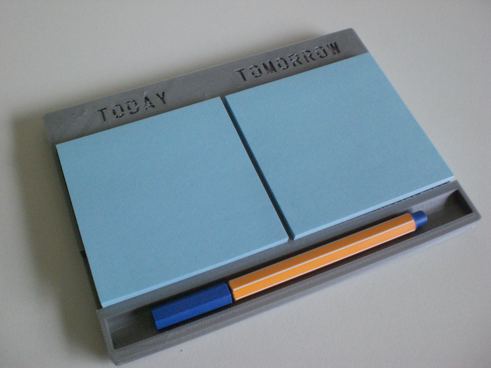

# My first 3d printed design – Post-It Note Holder

The design is a post-it note holder with one pad each for today and tomorrow. I find it handy to have a list of things that need to be done today and those that can wait!

Here is the 3d Model, It took a while to make as I had to draw all the letters manually. I am using FreeCAD and the design is parametric.

The following photo shows the printer halfway through the print after just completing the insets. The design takes 2 hours to print. In the later prints I used a 10 row skirt with 0 distance from the model which really helped to prevent the model from warping as it cooled.

Download the stl file here: [new.stl](./new.stl) or view on [Thingiverse](http://www.thingiverse.com/thing:39675).