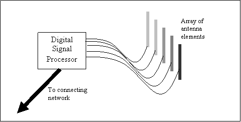
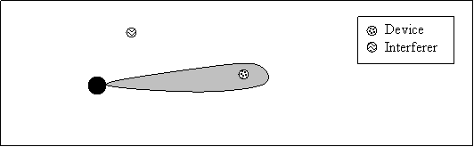
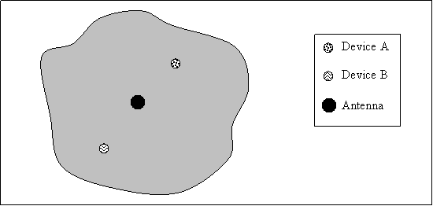
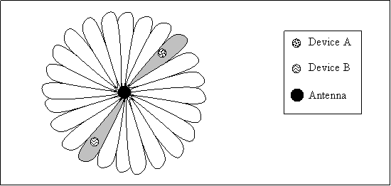
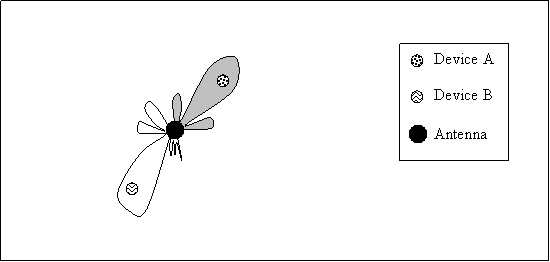
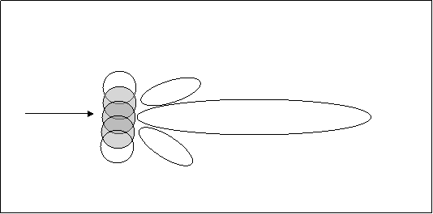
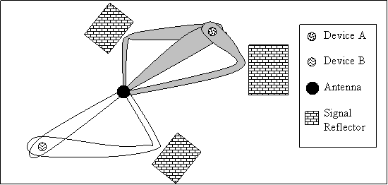
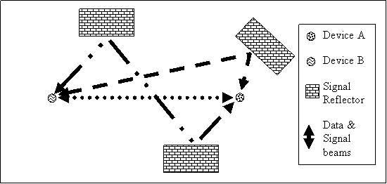

# Smart Antennas

## Introduction

A Smart Antenna is an antenna system which dynamically reacts to its environment to provide better signals and frequency usage for wireless communications. There are a variety of smart antennas which utilize different methods to provide improvements in various wireless applications. This report aims to explain the main types of smart antennas and there advantages and disadvantages.

## Smart Antennas

Contrary to the name smart antennas consist of more than an antenna. A smart antenna is a system involving multiple antenna elements and a signal processor (Usually digital) to adjust the radiation and or elements of the antenna (IEC 2004). Smart antennas usually use arrays of antennas linked to a control unit or digital signal processor (Lehne et al. 1999, p. 4). Current efforts into smart antenna development are for wireless digital networks, for use with mobile telephones and computer networks. The smart antennas developed for mobile telephone networks are focused on replacing standard base station antennas to communicate with standard antenna mobile phones, however in the future mobile phone handsets may also contain smart antennas.

The theory behind smart antennas has been around for some time. The technique of two parties ‘targeting’ each other with there transmissions being used in world war II to prevent jamming and eavesdropping form third parties. However smart antennas have recently become a viable option for large digital networks as computer processors now have sufficient computational power to process wireless signals in real time. (004p3)

Conveniently the emergence of powerful enough processors has also coincided with the need by communications carriers to be able to use their frequency space more efficiently. As the frequency space is limited and expensive to purchase carriers needed a way to support more users within the same frequency space.

Smart antennas work on the premise that interferes (devices which are also transmitting on the same frequency) are rarely in the same physical location as another device. Smart antennas exploit this by targeting antenna gain (sensitivity) in the direction individual devices (004p3). This means that signals from interferers are not received or much weaker than the signal we are transmitting and receiving with the desired device. Targeting devices also reduces the interference radiated to other devices, this means that other devices can use the same frequency. Having more than one set of devices using a frequency means that the capacity of the frequency space is effectively increased. A smart antenna is similar in function to a switch on a traditional wired computer network, sending signals only to the intended recipients.

There are several advantages and disadvantages to the use of smart antennas, which have been expanded upon below.

## Advantages

### Increased number of users

Due to the targeted nature of smart antennas frequencies can be reused allowing an increased number of users. More users on the same frequency space means that the network provider has lower operating costs in terms of purchasing frequency space.(Lehne et al. 1999, p. 5),(SYMENA 2004, p. 5)

### Increased Range

As the smart antenna focuses gain on the communicating device, the range of operation increases. This allows the area serviced by a smart antenna to increase. This can provide a cost saving to network providers as they will not require as many antennas/base stations to provide coverage.(Lehne et al. 1999, p. 5)

### Geographic Information

As smart antennas use ‘targeted’ signals the direction in which the antenna is transmitting and the gain required to communicate with a device can be used to determine the location of a device relatively accurately. This allows network providers to offer new services to devices. Some services include, guiding emergency services to your location, location based games and locality information. (Lehne et al. 1999, p. 5)

### Security

Smart antennas naturally provide increased security, as the signals are not radiated in all directions as in a traditional omni-directional antenna. This means that if someone wished to intercept transmissions they would need to be at the same location or between the two communicating devices.(Gadh et al. 2003)

### Reduced Interference

Interference which is usually caused by transmissions which radiate in all directions are less likely to occur due to the directionality introduced by the smart antenna. This aids both the ability to reuse frequencies and achieve greater range.

### Increased bandwidth

The bandwidth available increases form the reuse of frequencies and also in adaptive arrays as they can utilize the many paths which a signal may follow to reach a device.

### Easily integrated

Smart antennas are not a new protocol or standard so the antennas can be easily implemented with existing non smart antennas and devices.

## Disadvantages

### Complex

A disadvantage of smart antennas is that they are far more complicated than traditional antennas. This means that faults or problems may be harder to diagnose and more likely to occur.(Lehne et al. 1999, p. 5)

### More Expensive

As smart antennas are extremely complex, utilizing the latest in processing technology they are far more expensive than traditional antennas. However this cost must be weighed against the cost of frequency space.

### Larger Size

Due to the antenna arrays which are utilized by smart antenna systems, they are much larger in size than traditional systems. This can be a problem in a social context as antennas can be seen as ugly or unsightly.(Lehne et al. 1999, p. 6)

### Location

The location of smart antennas needs to be considered for optimal operation. Due to the directional beam that ‘swings’ from a smart antenna locations which are optimal for a traditional antenna are not for a smart antenna. For example in a road context, smart antennas are better situated away from the road, unlike normal antennas which are best situated along the road.(Lehne et al. 1999, p. 6)

## Types of Smart Antennas

There are three main types of smart antenna. They can be seen as evolutional types with each type being more complex and or smart then its predecessor.

### Normal

A normal antenna is not a smart antenna and simply attempts to radiate as much signal as possible uniformly around the antenna element.

### Switched Lobe

A switched lobe antenna has an array of directional antenna elements all covering different areas. The element in the direction of the device that communication is to take place is then used to transmit and receive. If a device moves out of the beam of an element the antenna must switch to transmit and receive on an element that does reach the device. Switched lobe antennas integrate well with existing normal antennas. They are also less complex than the other smart antennas meaning they may be more cheaply implemented. This may be a good antenna to use in an older network where the infrastructure will not remain in use for long enough to justify the outlay on more advanced antennas.

A switched lobe antenna provides some improvement over a normal antenna

### Dynamically Phased Array

Dynamically phased array antennas form a beam to a device digitally. The array forms a beam by activating certain omnidirectional elements in the array which have a multiplying effect to form a beam. This beam can then be ‘steered’ or pointed in the direction of a device by phasing the transmission of the signal in the elements and adjusting the gain on each antenna element. A dynamically phased array steers the created beam at the desired device. As the beams are formed digitally the same array of elements can target beams at multiple devices on multiple frequencies. Assuming two beams do not ‘illuminate’ the two devices they can use the same transmission frequency.

Digital beam forming requires a great deal of processing power, and so have only recently become a feasible technique.(Howard 2003, p. 7)

### Adaptive Array

An adaptive array is similar to a dynamically phased array however it performs more it is more ‘intelligent’ taking into account a greater number of factors. An adaptive array adapts to its environment by taking into account other interfering devices and multiple signal paths. Interfering devices can be ‘blocked’ by reducing the signal received form the antenna elements in that direction and increasing it in others. Multiple signal paths can be utilized by forming beams in the directions of signal paths meaning a combined signal can be formed from multiple beams. This provides a much better signal to noise ration giving clearer communication to a device.

Another technique which is being developed using smart antennas on both transmission devices is to use the multiple signal paths to transmit different data and create multiple data streams on the same frequency. This allows a higher bandwidth for communication between the two devices. This technology is called multiple input, multiple output (MIMO) and is being integrated into wireless LAN systems. (Lingblom 2003, p. 5)(Temme 2004, p. 33)(Cox 2004, p. 12)

## Conclusion

Smart antennas vastly improve the efficiency of wireless transmission and are likely to become the standard in use for connections between wireless devices. As the technology becomes cheaper it is likely that all devices will utilise smart antennas. This transition could be compared to the use of hubs in wired computer networks and there replacement with switching technology as the costs of implementation reduced.

## Reference

Lehne, PH & Pettersen, M & Telenor R&D. 1999, An overview of smart antenna technology for mobile communications systems, IEEE Communications Surveys, http://www.comsoc.org/pubs/surveys

Howard, R. 2003, Astute Antennas, Communications Systems Design, http://www.commsdesign.com/

Lingblom, M. 2003, Airgo chipset boosts Wi-Fi performace, CRN, http://www.crn.com/

Temme, C. 2004, MIMO opens lanes for wireless highway, Network World, http://www.nwfusion.com/

Cox, J. 2004, Wireless LAN industry starts raising antennas over MIMO, Network World, http://www.nwfusion.com/

IEC. 2004, Smart Antenna Systems, International Engineering Consortuim, http://www.iec.org/online/tutorials/smart_ant/

SYMENA. 2004, Smart Antennas – A Nontechnical Introduction, SYENA Software & Consulting GmbH, http://www.syena.com/

Gadh, R & Rao, K & Sridhar, V. 2003, Enhancing WLAN Security, COMPUTERWORLD, http://www.computerworld.com/printthis/2003/0,4814,86668,00.html