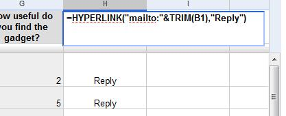
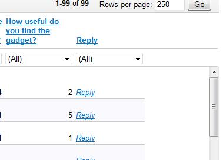

# Easily reply to your google form responses

Google Docs lets you really easily create [web forms](http://googlesystem.blogspot.com/2008/08/easier-way-to-create-forms-in-google.html), which are great for surveys, site feedback and more (and importantly free). However responding to submitted forms can be a little more difficult as your data just ends up in a big spreadsheet.

Luckily you can use a spreadsheet formula to easily create a ‘Reply’ email link for each submitted form using these steps:

1. Create a [google form](http://googlesystem.blogspot.com/2008/08/easier-way-to-create-forms-in-google.html). Make sure that you create a field on your form to collect an email address.
2. Open your forms spreadsheet and select the very top cell of an empty column to place the ‘Reply’ links in.
3. Insert `=HYPERLINK(“mailto:”&TRIM(B1),”Reply”)` into the cell (bold text only) replacing the text ‘B1’ with the top cell of the column that contains the email addresses from your form.
4. Click the letter at the top of the column to select all of that column’s cells and press CTRL + D to fill the formula down to all the cells.
5. Go to the view menu and select ‘List View’ to make the links easily clickable.

Unfortunately you cannot automatically populate the subject and body of the email. Whilst google spreadsheet supports `mailto:` urls it doesn’t support the `?subject=` and `&body=` extensions.

