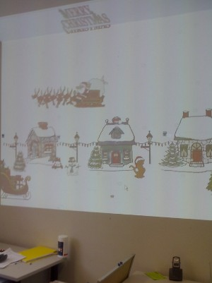

# Interactive Christmas Display

This year for Christmas I made an ‘Interactive’ Christmas Display. It is a simple JavaScript web page that lets you select and place animated gif’s on the page. We projected it on the wall as virtual Christmas decorations at the office. Passersby are free to add new images to the scene as they please.

You can try it out or use it in your office:

1. Go to [Interactive Christmas](https://hallzhallz.github.io/InteractiveChristmas/index.htm).
2. Move your mouse to the top of the page to see the menu.
3. Click on an image to select it.
4. Then click on the page to place the image.

Merry Christmas!