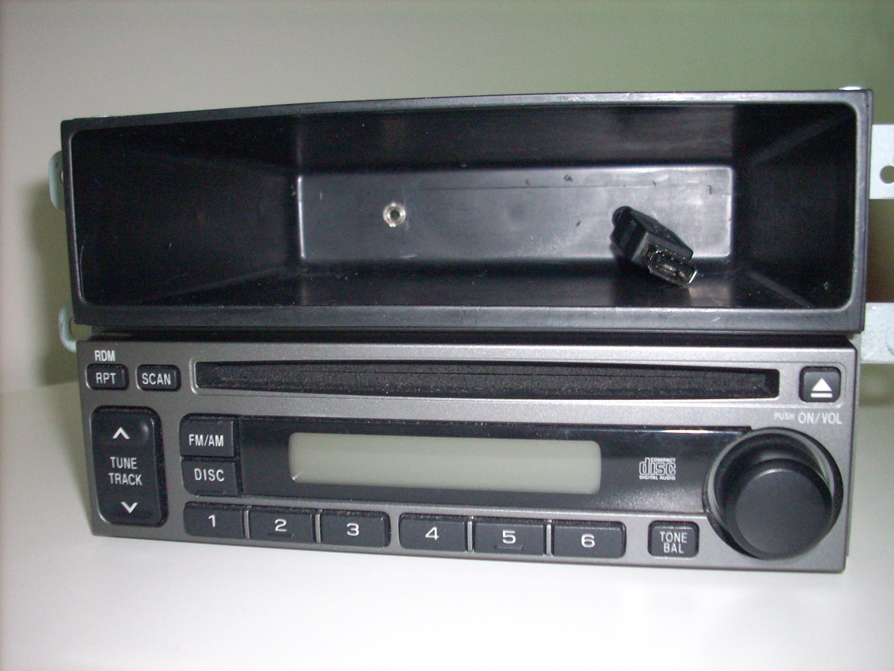
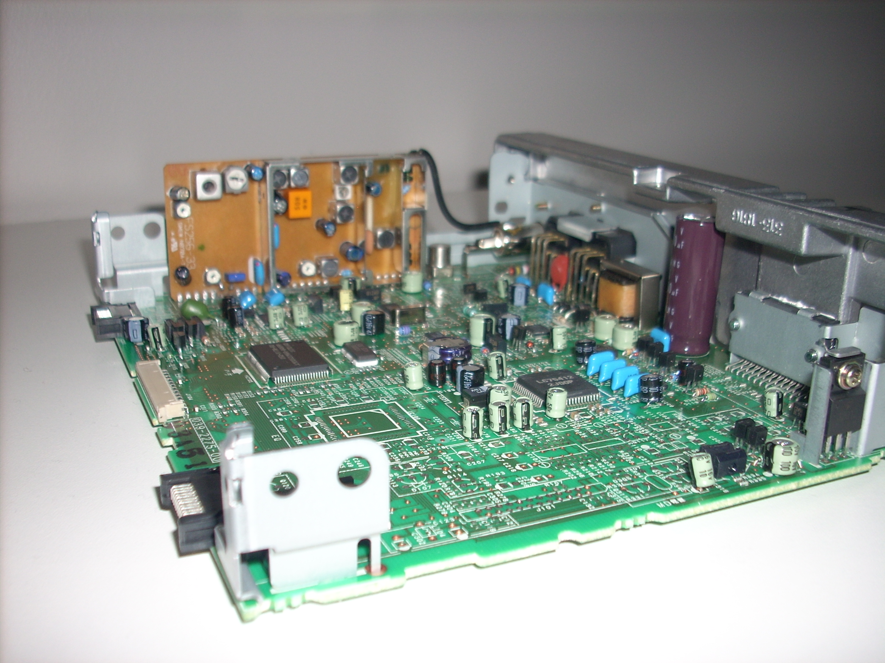
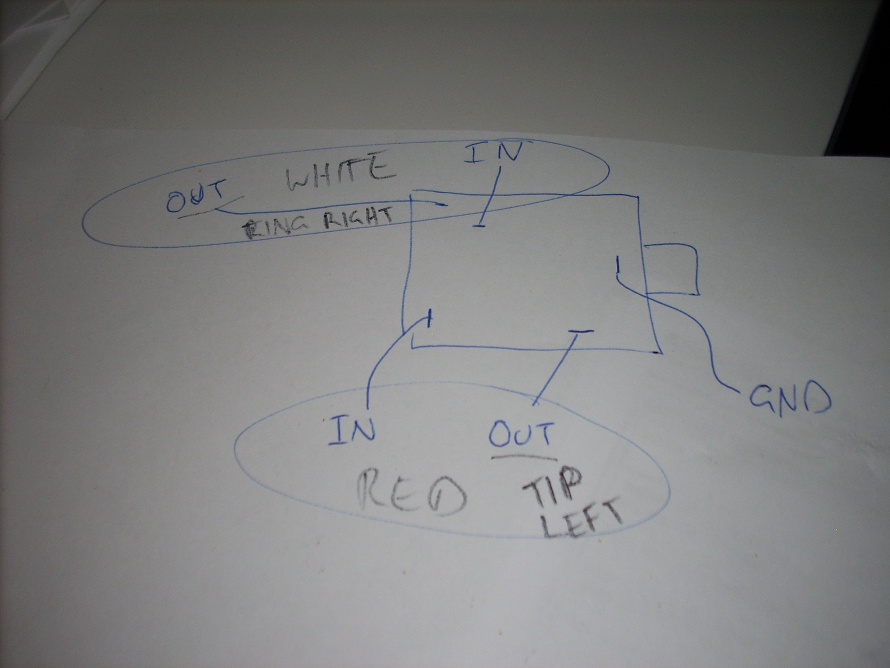
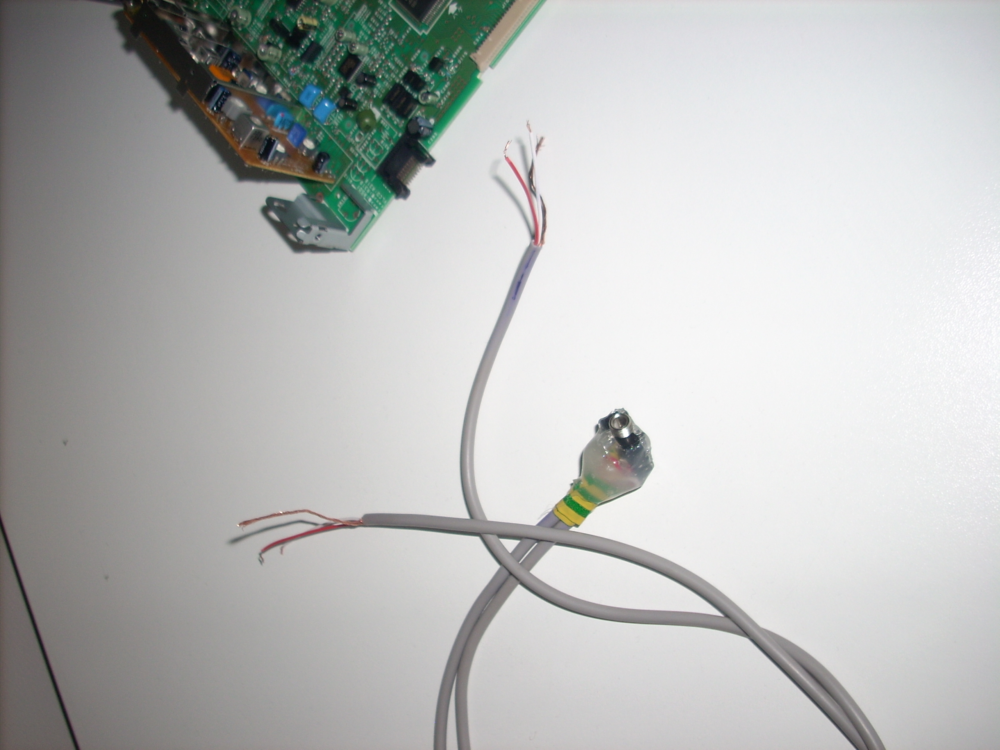
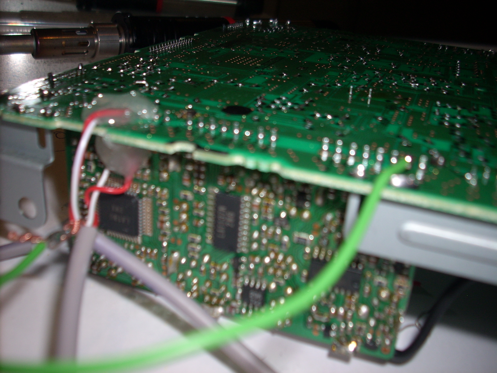
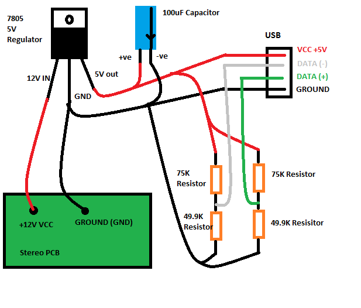
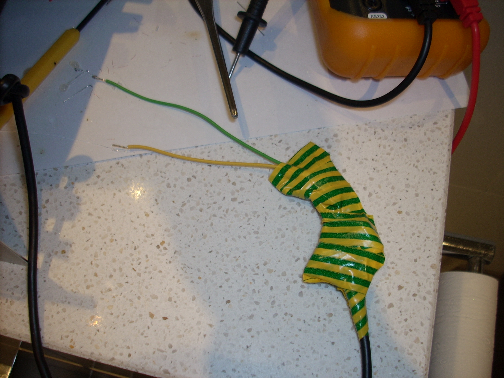
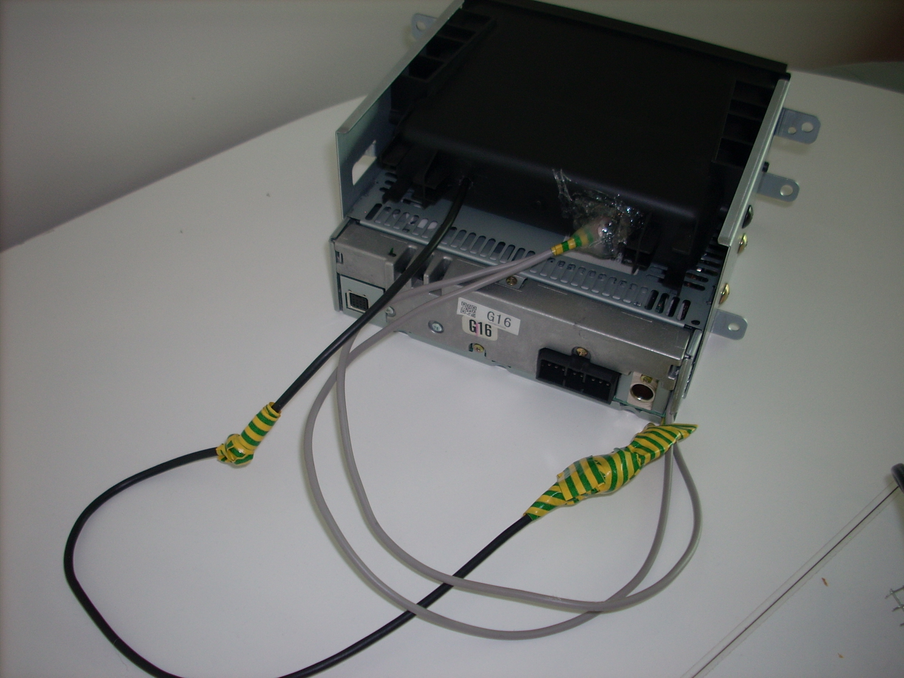

# Adding Aux Line-in (and USB Power) to an 03 Subaru Impreza Stock Radio

I was impressed with [Jordan’s simple hack](http://www.electronicsjunk.com/index.php?option=com_content&view=article&id=63:mp3-imput-for-my-2004-subaru&catid=35:projects&Itemid=60) to add an auxilary input to a stock stero head unit and had to try it myself. As my head unit is rather busy on the front panel I routed the input jack into the back of the tray above. I also added a USB charging socket using a 7805 Voltage Regualtor and the data line configuration from [Ladyada’s Minty Boost](https://www.ladyada.net/make/mintyboost/parts.html).

**WARNING:** Obviously opening up your radio and cutting/soldering risks breaking it and will most definitely void your warranty, be prepared to buy a new head unit if it all goes wrong.

## Step One: Removing the Head Unit and Cage

On many Subaru’s you have to remove the centre console in order to remove the head unit cage. However on my 03 Impreza Sportswagon all you have to do is pop open the drink holder above the stereo and then gently pop the trim off from around the head unit. Unfortunately I did not figure this out until I had removed my entire centre console! So hopefully the same won’t happen to you.

## Step Two: Locating the Radio Lines

I’d recommend reading Jordan’s Post as a reference. You will need to dissasemble your stereo until you can find a point on the circuit board where you can safely cut the radio lines (FM or AM) and then reconnect them through the 3.5mm switching socket. Try and find points where components are soldered in to add your wires, soldering to a track is virtually impossible.

If you can’t locate the lines, you will need to do some diagnostics with a multimeter or give up.

## Step Three: Wiring Up the Switching Socket/Jack

[From wikipedia](http://en.wikipedia.org/wiki/TRS_connector#Tip.2Fring.2Fsleeve_terminology) in a 3.5mm stereo jack the tip is left channel, the ring is the right channel and the  Base/last ring is the ground. You will need to look at the data sheet from your socket to determine which pins are which and then solder a wire to each. The pictures show the wiring I used for a socket I bought from Jaycar in Australia.

## Step Four: Cut the Radio Left and Right Lines and Solder in the Socket

Since my stereo has the radio on a seperate little board inside, I severed the connection between the radio and main amp board for the two FM channels. In retrospect I would have been better finding a section of track to cut as the connection between teh two boards was really strong and I had to use a drill to cut away the connections.

Once the connections were severed I connected the OUT wire connections from the socket to the amplifier side of the lines and the IN wire connections to the Radio side. I soldered the ground wires to the same ground pin on the amplifier side of the stereo (green wire in step five picture).

## Step Five: Test Connections with a Multimeter Then Glue

Set the multimeter to the beep test (resistance) and check that none of your lines are connected to each other and also that they are connected to the board (probe your connection and next connection along track). Once the connections are checked then you need to glue down the wires so they do not come loose during your next rally.

## Step Six: USB Charging Circuit

For the charging circuit I soldered together a USB Socket and the components on the left as per the diagram. Covering the entire circuit in electrical tape to protect it and then soldering it to the VCC and Ground of the stereo. Once again I checked the connections and glued to hold in place.

The data lines attach into the resistor ladder network in order to be held at 2 volts each. This tells many products (Ipods etc – see the [minty boost compatability list](http://www.ladyada.net/make/mintyboost/compat3.html)) to charge and draw half an amp.

**NOTE:** If you use a USB cable socket as I have you will need to thread the cable through the tray before soldering up the charging circuit.

## Step Seven: Mount the connectors

Carefully re-assemble your stereo and route the cables out the back (you may need to bend the casing or drill a hole).

Drill a hole for the 3.5mm socket and mount it into the plastic tray using the screw on the socket and with glue at the back.

If your USB socket is a cable like mine, wrap some electrical tape around the cable as pictures to stop it pulling through and breaking the soldered connections.

## Step Eight: Re-install

Plug in your stereo before re mounting and turn it on. Be ready to turn it off quickly if there is any smoke, sparks, or bad burning smells, if this happens then something is wired wrong, dis-assemble and re-check everything.

If it powers on without issue check the CD, AM/FM etc are all working as well as your new auxilary line in. Onces it is all working remount the stereo and re-attach the trim etc.

All Done!
