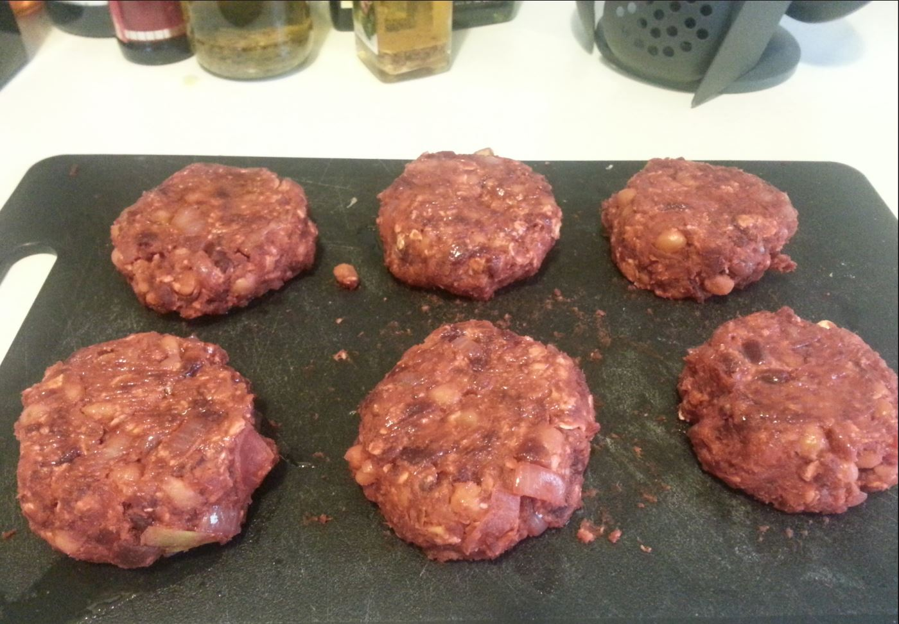

# Beetroot Burgers

## Ingredients

- 1 medium onion
- 2 cloves garlic
- 1 can chick peas
- 1 tbsp olive oil
- 1 large can of sliced beetroot
- 1 sachet tomato paste
- 1/2 teaspoon cinnamon
- 1/2+ Cups Oats

## Directions
1. Chop onion and garlic and fry with olive oil in a pan. Then add chick peas and continue to fry until golden.
2. Meanwhile drain can of beetroot and reserve several large slices for burgers.
3. Place the rest in a microwave safe bowl and cook on high for 3-4 minutes.
4. Remove and drain any liquid.
5. Place the following ingredients into the food processor:
  1. Beetroot
  2. Chick Pea Mixture
  3. Tomato Paste
  4. Cinnamon
6. Pulse until a thick paste forms (don’t over do it).
7. Place mixture in a bowl and stir in 1/2 cup of oats.
  1. Add extra oats if the mixture is too sloppy.
8. Refrigerate mixture for 15 minutes.
9. Form into 6 burger patties.
10. Brush or spray with olive oil.
11. Then BBQ.
12. Add to a burger bun with your favourite fillings.
13. Enjoy!

